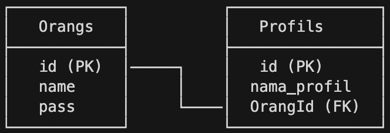
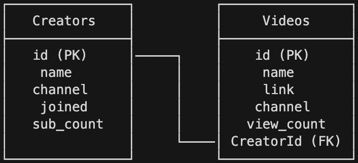

## Table of Content
1. [Recap Associations](#recap-associations)
1. [Associations in Sequelize](#associations-in-sequelize)
1. [Let's Make the App](#lets-make-the-app)
1. [References](#references)

## Recap Associations
Pada saat kita mempelajari SQL, pasti erat dengan kata kata `Associations`
bukan?

Mari kita coba mengingat lagi yah, associations itu apa !

`Associations`, merupakan relasi atau hubungan antar 2 entitas objek 
berdasarkan adanya suatu atribut yang memiliki kesamaan.

Gunanya untuk apa?

Gunanya adalah untuk membuat satu entitas dapat mengakses data dari
entitas lainnya, via atribut yang sama ini.

Contoh: Pada sebuah Departemen yang memiliki suatu data unik, pastinya bisa
mengakses karyawan yang terdaftar pada Departemen tsb karena tiap karyawan
memiliki data unik dari Departemen tersebut.

Hubungan / relasi ini sifatnya bisa banyak:
* 1-to-1 (One-to-One)
* 1-to-n (One-to-Many)
* n-to-n (Many-to-Many)

Karena kita sedang belajar `sequelize`, Pertanyaannya sekarang adalah, 
bagaimanakah cara kita mengimplementasikannya dalam `sequelize` ?

Apakah memungkinkan ?

## Associations in Sequelize

`sequelize` ini memungkinkan sekali untuk membuat `association`, bahkan
tanpa kita perlu menulis *query* nya loh !

Tapi selalu ada harga yang dibayarkan untuk membuat hal-hal seperti ini,
harganya adalah kita harus mengerti bagaimana cara untuk membuat `association`
ini dengan cara `sequelize` itu sendiri !

Contohnya bagaimana ?

1-to-1  


Dalam `sequelize` punya `Model`, berarti kita harus:
* Mendefinisikan bahwa `Orang` memiliki sebuah `Profile`
* Mendefinisikan bahwa `Profile` adalah bagian dari / milik `Orang`

Caranya adalah, kita harus memodifikasi bagian `models` yang dibuat dengan
mendefinisikan association pada method associate yang ada.

```javascript
// File: models/orang.js
...
  static associate(models) {
    // hasOne
    //   sourceKey <-- untuk Source punya PK
    //   foreignKey <-- untuk Target punya FK
    //   -------------------------------------
    //   by default akan melihat apakah pada Target memiliki SourceId
    //   e.g. OrangId pada Profils
    Orang.hasOne(Profil, {
      sourceKey: 'id',
      foreignKey: 'OrangId'
    });
  }
```

```javascript
// File: models/profil.js
...
  static associate(models) {
    // belongsTo
    //   foreignKey <-- untuk Source punya FK
    //   targetKey <-- untuk Target punya PK
    // ----------------------------------------------
    //   by default akan melihat apakah pada Source memiliki TargetId
    //   e.g. OrangId pada Profils
    Profil.belongsTo(Orang, {
      foreignKey: 'OrangId',
      targetKey: 'id'
    });
  }
```

1-to-n  


Dalam `sequelize` punya `Model` ini, berarti kita harus:
* Mendefinisikan bahwa `Creator` memiliki banyak `Video`
* Mendefinisikan bahwa `Video` dimiliki oleh `Creator`

Caranya adalah, kita harus memodifikasi bagian `models` yang dibuat dengan
mendefinisikan association pada method associate yang ada.

```javascript
// File: models/creator.js
...
  static associate(models) {
    // hasMany
    //   sourceKey <-- untuk Source punya PK
    //   foreignKey <-- untuk Target punya FK
    //   ------------------------------------------------------------
    //   by default akan melihat apakah pada Target memiliki SourceId
    //   e.g. CreatorId pada Videos
    Creator.hasMany(models.Video, {
      sourceKey: 'id',
      foreignKey: 'CreatorId'
    });
  }
```

```javascript
// File: models/video.js
...
  static associate(models) {
    // belongsTo
    //   foreignKey <-- untuk Source punya FK
    //   targetKey <-- untuk Target punya PK
    // ----------------------------------------------
    //   by default akan melihat apakah pada Source memiliki TargetId
    //   e.g. CreatorId pada Videos
    Video.belongsTo(models.Creator, {
      foreignKey: 'CreatorId',
      targetKey: 'id'
    });
  }
```

n-to-n
```
Untuk n-to-n akan dibahas pada pembelajaran selanjutnya
```

## Let's Make the App
Sekarang mari kita mencoba untuk membuat aplikasinya (1-to-n)

Requirement dari aplikasi ini adalah:
* Diberikan sebuah database pada `postgresql` dengan nama `development`
* Dengan diberikan sebuah data `data/creator.json` dan `data/video.json`,
  buatlah tabel dengan nama `Creators` dan `Videos`.
* Tabel `Creators` dan `Videos` akan memiliki kolom yang dapat dilihat pada 
  [Tabel 1](#tabel-1)

* Buatlah sebuah aplikasi web sederhana yang akan memiliki endpoint yang dapat
  dilihat pada [Tabel 2](#tabel-2)

#### Tabel 1
```
Creators
```

| Kolom              | Tipe         | Deskripsi   |
|:-------------------|:-------------|:------------|
| id                 | SERIAL       | PRIMARY KEY |
| name               | VARCHAR(255) | NOT NULL    |
| channel            | VARCHAR(255) | NOT NULL    |
| joined             | VARCHAR(255) | NOT NULL    |
| subscribers_count  | VARCHAR(255) | NOT NULL    |
| createdAt          | TIMESTAMP    | NOT NULL    |
| updatedAt          | TIMESTAMP    | NOT NULL    |

```
Videos
```

| Kolom              | Tipe         | Deskripsi   |
|:-------------------|:-------------|:------------|
| id                 | SERIAL       | PRIMARY KEY |
| name               | VARCHAR(255) | NOT NULL    |
| link               | VARCHAR(255) | NOT NULL    |
| channel            | VARCHAR(255) | NOT NULL    |
| view_count         | INTEGER      | NOT NULL    |
| CreatorId          | INTEGER      | FOREIGN KEY |
| createdAt          | TIMESTAMP    | NOT NULL    |
| updatedAt          | TIMESTAMP    | NOT NULL    |

#### Tabel 2

| Endpoint           | Deskripsi                                              |
|:-------------------|:-------------------------------------------------------|
| GET /              | Menampilkan list semua link                            |
| GET /creators      | Menampilkan list data `Creators`                       |
| GET /videos        | Menampilkan list data `Videos`                         |
| GET /combos        | Menampilkan list data gabungan `Creators` dan `Videos` |

Jadi setelah melihat requirement seperti, apa sajakah yang harus kita lakukan?

### Langkah 1 - Inisialisasi & Install module yang dibutuhkan terlebih dahulu
**Disclaimer**:
Pada pembelajaran kali ini, sudah disediakan `starter-pack`, yang akan
digunakan untuk mempelajari bahan ini, sehingga diharapkan sebelum mempelajari
bahan ini, Anda sudah mengerti pembuatan `views` pada `express` dengan `ejs`
dan `routing endpoint` pada `express`.

Pertama-tama kita harus menginisialisasi folder dan module yang dibutuhkan
dengan cara:
* Melakukan `npm init -y`
* Menginstall module yang dibutuhkan `express`, `ejs`, `pg`, dan `sequelize`
  dengan `npm install express ejs pg sequelize`
* Menginstall module yang dibutuhkan pada saat `development` yaitu `nodemon`
  dan `sequelize-cli` dengan `npm install -D nodemon sequelize-cli`

Maka setelah menjalankan langkah di atas, bentuk folder `starter-pack` 
akan menjadi seperti ini:
```
.
├── controllers
│   └── controller.js
├── data
│   ├── creator.json
│   └── video.json
├── node_modules
│   └── ...
├── routes
│   └── ...
├── views
│   └── ...
├── .gitignore
├── app.js
├── package.json
└── package-lock.json
```

### Langkah 2 - Inisialisasi dan Konfigurasi sequelize
Selanjutnya setelah kita melakukan inisialisasi dan konfigurasi `sequelize` 
dengan cara:
* Inisialisasi sequelize dengan `npx sequelize-cli init`
* Setelah perintah di atas diketik, maka akan terbentuk folder:
    * `config`, yang digunakan untuk menyimpan konfigurasi database
    * `migrations`, yang digunakan untuk membuat atau mengubah tabel pada 
       database
    * `models`, yang digunakan untuk membuat Model representasi tabel data
    * `seeders`, yang digunakan untuk memasukkan data awal.
* Mengedit file konfigurasi pada `config/config.json` dengan memasukkan 
  credential yang tepat, dan `dialect` yang diubah ke `postgres`
* Setelah melakukan konfigurasi di atas, dengan menggunakan GUI / CLI untuk 
  `postgresql` buatlah database dengan nama `development`. 

### Langkah 3 - Membuat tabel Creators dan Videos
Selanjutnya adalah kita akan membuat model `Creator` dengan tabel `Creators` 
dan model `Video` dengan tabel `Videos` sekaligus dengan menggunakan 
`sequelize`. Caranya adalah dengan:
* Melihat ulang terlebih dahulu struktur tabel yang dibutuhkan, perhatikan 
  bahwa pada struktur tabel memiliki `id`, namun pada saat kita menggunakan
  `sequelize` kita tidak perlu menuliskan hal tersebut, karena akan dibuat
  secara otomatis. 
* Berdasarkan info ini, maka pada tabel `Creators`, yang butuh dibuat adalah
  `name`, `channel`, `joined`, dan `subscribers_count`.
* Berdasarkan info ini, maka pada tabel `Videos`, yang butuh dibuat adalah
  `name`, `link`, `channel`, dan `view_count`.
* Harus diingat juga ketika membuat model dan tables / migrations, perhatikan
  bahwa nama pada Model = `Singular` dan nama table = `Plurals`.
  `Jangan sampai terbalik yah !`
* Sehingga, berdasarkan data ini, maka yang harus diketik adalah 
  `npx sequelize-cli model:generate --name Creator --attributes \
  name:String,channel:String,joined:String,subscribers_count:String` dan
  `npx sequelize-cli model:generate --name Video --attributes \
  name:String,link:String,channel:String,view_count:Integer` 
* Setelah perintah di atas diketik, maka akan terbentuk sebuah file pada 
  folder `models` dan sebuah file pada folder `migrations`, coba lihat file
  pad `models` dan `migrations`  untuk mengetahui lebih lanjut bagaimaan kode
  dibuat.
* Dikarenakan kita di sini masih ingin menggunakan `promise` instead of
  `async / await`, maka kita akan melakukan edit pada file `migrations` yang
  baru dibuat oleh `sequelize`, contoh perubahan untuk mengubah `async / await`
  menjadi `promise` dapat dilihat pada [Code 00](#code-00)
* Jangan lupakan untuk seluruh data ditambahkan property `allowNull: false`
  pada file `migrations` yang terbentuk.
* Selanjutnya, kita akan menjalankan perintah untuk membuat tabel ini dengan 
  menjalankan perintah `npx sequelize-cli db:migrate`
* Setelah menjalankan perintah ini, maka dapat dilihat pada postgresql bahwa 
  tabel `Creators` dan `Videos` sudah terbentuk.

#### Code 00
```javascript
'use strict';
module.exports = {
  // Awalnya di sini ada async bukan ?
  // kita akan mengubah nya dengan cara 
  // membuang keyword async tersebut
  up: (queryInterface, Sequelize) => {
    // Kemudian di sini harusnya ada await bukan?
    // kita akan mengganti keyword await tersebut
    // menjadi return.
    // Hal ini dapat terjadi karena 
    // queryInterface.createTable sudah bersifat Promise.
    return queryInterface.createTable('...', {
      ...
    });
  },

  // sama dengan yang ada di up tadi, 
  // keyword asyncnya dibuang
  // dan await nya diganti return.
  down: (queryInterface, Sequelize) => {
    return queryInterface.dropTable('...');
  }
};
```

### Langkah 4 - Memodifikasi Model untuk mendefinisikan asosiasi
Karena adanya relasi antara dua tabel `Creators` (id) dengan `Videos`
(CreatorId), maka selanjutnya kita akan menambah kolom dan menyambungkan
kolom dengan asosiasi-nya.

Apabila hanya membutuhkan `CreatorId` saja, maka kita hanya butuh untuk:
* Membuat file migrations baru untuk `Videos`
* Menambahkan kolom `CreatorId` pada `Videos` (Migration)
* Menambahkan kolom `CreatorId` pada `Video` (Model)
* Tidak perlu menambahkan / mendefinisikan Foreign Key pada Tabel `Videos`

Langkah-langkahnya adalah:
* Membuat file migration baru dengan cara mengetik perintah:
  `npx sequelize-cli migration:generate --name add-column-creatorid-to-videos`
* Menambahkan kode untuk menambah kolom `CreatorId` pada migration file yang
  dibuat. Kode dapat dilihat di bawah ini
  
```javascript
// File: migrations/<timestamp>-add-column-creatorid-to-videos
module.exports = {
  up: (queryInterface, Sequelize) => {
    // Di sini kita menggunakan addColumn
    // untuk menambahkan kolom CreatorId
    return queryInterface.addColumn('Videos', 'CreatorId', { 
      type: Sequelize.INTEGER,
      references: {
        model: {
          tableName: 'Creators',
        },
        onUpdate: 'CASCADE',
        onDelete: 'CASCADE',
        key: 'id'
      }
    });
  },

  down: (queryInterface, Sequelize) => {
    // Di sini kita akan menghapus 
    // kolom CreatorId
    return queryInterface.removeColumn('Videos', 'CreatorId');
  }
};
```
* Selanjutnya, kita akan menambahkan asosiasi pada `models/creator.js` dan 
  `models/video.js`

```javascript
// File: models/creator.js
  class Creator extends Model {
    static associate(models) {
      // define association here
      Creator.hasMany(models.Video, {
        sourceKey: 'id',
        foreignKey: 'CreatorId'
      });
    }
  };
```

```javascript
// File: models/video.js
  class Video extends Model {
    static associate(models) {
      // define association here
      Video.belongsTo(models.Creator, {
        foreignKey: 'CreatorId',
        targetKey: 'id'
      });
    }
  };
```

### Langkah 4 - Membuat seeder
Selanjutnya, setelah tabel terbentuk, kita akan memasukkan data yang kita
miliki dalam `data/creators.json` dan `data/videos.json` menjadi data dalam
tabel kita, oleh karena itu langkah-langkahnya adalah:
* Membuat file seed dengan cara mengetik perintah 
  `npx sequelize-cli seed:generate --name seed-creators` dan
  `npx sequelize-cli seed:generate --name seed-videos`
* Setelah mengetik perintah di atas, maka akan terbentuk file baru dengan nama
  `seeders/<timestamp>-seed-creators.js` dan 
  `seeders/<timestamp>-seed-videos.js`, buka file tersebut dan kita akan 
  mengedit file tersebut. Kode yang akan ditulis dapat dilihat pada 
  [Code 01](#code-01)
* Setelah menuliskan kode tersebut, kita akan melakukan *seeding* dengan cara 
  mengetik `npx sequelize db:seed:all`

#### Code 01
```javascript
'use strict';
// 01.
// Jangan lupa fs karena kita mau baca json
const fs = require('fs');

module.exports = {
  up: (queryInterface, Sequelize) => {
    // 02.
    // Di sini kita akan membaca filenya terlebih dahulu
    // Ingat bahwa pada sequelize semua tabel akan memiliki 2 kolom tambahan
    // createdAt dan updatedAt
    // sehingga kita harus memasukkan data tersebut.

    let creators = JSON.parse(fs.readFileSync('./data/creators.json', 'utf8'));

    creators = creators.map(elem => {
      // Jangan lupa dipetakan karena dalam tabel Creators dibutuhkan 
      // 2 tambahan kolom ini
      elem.createdAt = new Date();
      elem.updatedAt = new Date();

      return elem;
    })

    // 03. 
    // Masukkan data ke dalam tabel Creators
    // Kita gunakan 
    // return queryInterface.bulkInsert('NamaTabel', arrayObj, opt)
    return queryInterface.bulkInsert(
      'Creators', 
      creators, 
      {}
    );
  },

  down: (queryInterface, Sequelize) => {
    // Ceritanya, kalau ada up (kita melakukan)
    // down (kita mereverse apa yang kita lakukan)
    // Kita gunakan 
    // return queryInterface.bulkDelete('NamaTabel', arrayObj, opt)
    return queryInterface.bulkDelete('Creators', null, {});
  }
};
```

```javascript
'use strict';
// 01.
// Jangan lupa fs karena kita mau baca json
const fs = require('fs');

module.exports = {
  up: (queryInterface, Sequelize) => {
    // 02.
    // Di sini kita akan membaca filenya terlebih dahulu
    // Ingat bahwa pada sequelize semua tabel akan memiliki 2 kolom tambahan
    // createdAt dan updatedAt
    // sehingga kita harus memasukkan data tersebut.

    let videos = JSON.parse(fs.readFileSync('./data/videos.json', 'utf8'));

    videos = videos.map(elem => {
      // Jangan lupa dipetakan karena dalam tabel Videos dibutuhkan 
      // 2 tambahan kolom ini
      elem.createdAt = new Date();
      elem.updatedAt = new Date();

      return elem;
    })

    // 03. 
    // Masukkan data ke dalam tabel Videos
    // Kita gunakan 
    // return queryInterface.bulkInsert('NamaTabel', arrayObj, opt)
    return queryInterface.bulkInsert(
      'Videos', 
      videos, 
      {}
    );
  },

  down: (queryInterface, Sequelize) => {
    // Ceritanya, kalau ada up (kita melakukan)
    // down (kita mereverse apa yang kita lakukan)
    // Kita gunakan 
    // return queryInterface.bulkDelete('NamaTabel', arrayObj, opt)
    return queryInterface.bulkDelete('Videos', null, {});
  }
};
```

Sampai dengan tahap ini, artinya kita sudah berhasil mendefinisikan asosiasi
pada `sequelize` dengan baik.

Selanjutnya adalah saatnya kita untuk memodifikasi dan menambahkan kode untuk
melihat data yang sudah terhubung ini.

### Langkah 6 - Load the Data
Selanjutnya, seperti umumnya langkah kita dalam menampilkan data ini,
maka kita akan mencoba untuk memodifikasi kode yang ada pada 
`controllers/controller.js` agar dapat menampilkan data yang sudah kita 
gabungkan ini.

Untuk dokumentasi `sequelize` nya dapat dilihat pada Referensi 
`Fetching data Associations`

Terdapat 2 cara untuk melakukan penampilan data ini, yaitu dengan menggunakan
`Lazy Loading` dan `Eager Loading`:
* `Lazy Loading` --> Data `Association` akan dipanggil via method 
  `getNamaTarget`, mengembalikan Promise
* `Eager Loading` --> Data `Association` akan dipanggil pada setting `option`
  pada method querynya.

Cara menggunakan `Lazy Loading`, misalnya pada `Creator` kita ingin 
memanggil `Video` atau sebaliknya, maka

```javascript
class Controller {
  static returnCreatorWithVideos(req, res) {
    Creator.findOne({
      where: {
        id: 1
      }
    }) // <-- mengembalikan promise
      .then((data) => {
        // Ingat, karena Creator hasMany Video,
        // maka method yang dipanggil bentuk jamak
        return data.getVideos(); // <--- sifatnya promise lagi
      })
      .then((data) => {
        res.send(data);
      })
      .catch(err) => {
        res.send(err);
      }
  }

  static returnVideoWithCreator(req, res) {
    Video.findOne({
      where: {
        id: 1
      }
    }) // <--- mengembalikan promise
      .then((data) => {
        // Ingat, karena Video belongsTo Creator,
        // maka method yang dipanggil bentuk singular
        return data.getCreator(); // <--- sifatnya promise lagi
      })
      .then((data) => {
        res.send(data);
      })
      .catch((err) => {
        res.send(err);
      })
  }
}
```

Cara ini kurang efisien bukan ? karena apabila harus menggunakan `findAll`, 
maka masih harus melakukan looping per element untuk memanggil method untuk
menampilkan data tersebut. Maka dari itu, ada suatu cara yang kedua yang 
dinamakan dengan `Eager Loading` supaya lebih cepat untuk menampilkan datanya,
caranya pun cukup mudah yaitu dengan menambahkan option `include` pada method
querynya, cara ini juga yang akan digunakan pada kode kita.

```javascript
// File: controllers/controller.js
...
  static getCombinationRootHandler(req, res) {
    // Apabila dilihat dari sisi Creator
    Creator
      .findAll({
        // Jangan lupa menambahkan option include, valuenya berupa Array
        include: [
          Video
        ]
      })
      .then(data => {
        res.send(data);
      })
      .catch(err => {
        res.send(err);
      });
  }
```

```javascript
// File: controllers/controller.js
  static getCombinationRootHandler(req, res) {
    // Apabila dilihat dari sisi Video
    Video
      .findAll({
        // Jangan lupa menambahkan option include, valuenya berupa Array
        include: [
          Creator
        ]
      })
      .then(data => {
        res.send(data);
      })
      .catch(err => {
        res.send(err);
      });
  }
```

Dan dengan demikian artinya kita sudah selesai untuk mempelajari bagaimana 
caranya kita untuk melakukan `Assocation` pada sequelize dan cara untuk 
menampilkan data kombinasi `Association` tersebut !

## References
* [What is Associations, Oracle](https://docs.oracle.com/cd/A97335_02/apps.102/bc4j/developing_bc_projects/bc_awhatisanassoc.htm)
* [Fetching data Associations](https://sequelize.org/master/manual/assocs.html#basics-of-queries-involving-associations)
* [Sequelize Documentation](https://sequelize.org/v5/)
* [Sequelize API Ref](https://sequelize.org/v5/identifiers.html)


<!-- 
```
┌────────────┐          ┌────────────────┐
│   Orangs   │          │   Profils      │
├────────────┤          ├────────────────┤
│   id (PK)  │─────┐    │   id (PK)      │
│   name     │     │    │  nama_profil   │
│   pass     │     └────│  OrangId (FK)  │
└────────────┘          └────────────────┘
``` -->

<!-- ```
┌───────────────┐          ┌────────────────┐
│   Creators    │          │     Videos     │
├───────────────┤          ├────────────────┤
│   id (PK)     │─────┐    │    id (PK)     │
│    name       │     │    │     name       │
│   channel     │     │    │     link       │
│    joined     │     │    │    channel     │
│   sub_count   │     │    │   view_count   │
│               │     └────│ CreatorId (FK) │
└───────────────┘          └────────────────┘
``` -->

<!-- Namun, karena kita sudah memiliki data bawaan berupa `channel` yang terhubung
antara `Videos` dan `Creators`, maka yang dibutuhkan sekarang, hanya:
* Mendefinisikan asosiasi `Videos` adalah milik `Creators` via `channel`.
* Mendefinisikan asosiasi `Creators` memiliki banyak `Videos` via `channel`. -->
